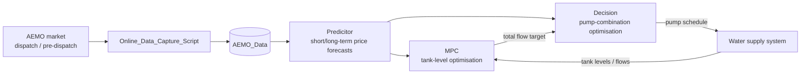

```markdown
# EMPC_Water_Electricity_Forecast

Forecasting of electricity prices for economic model predictive control (EMPC) of pumping in water supply systems.

<!-- status badges (placeholders) -->


## 1. Capstone Project Overview

### 1.1 Background and Objectives

Energy costs associated with pumping in water distribution systems can be large. Some water companies buy electricity directly from the wholesale market, where the price varies randomly every 5 minutes. Water storages in distribution networks provide robustness against pump or pipeline failures, and they also allow operators to shift pumping from high-price periods to low-price periods.

A promising strategy for reducing energy cost is **economic model predictive control (EMPC)**, which requires forecasts of the electricity prices. AEMO (Australian Energy Market Operator) provides publicly available market data and forecasts.

The project goals are:

- Model the electricity price forecast error with parameterised models such as AR and ARMA.
- Estimate the model parameters online, taking into account that the forecasts are used in an EMPC setting.
- Implement an economic MPC strategy for pumping operation in a water supply system.

### 1.2 System Composition and Workflow



- **Online_Data_Capture_Script** fetches AEMO dispatch data (5-min updates) and pre-dispatch data (30-min forecasts, 48 h ahead) and appends them to `AEMO_Data`.
- **Predicitor** produces short-term and long-term electricity price forecasts, consumed by both optimisation layers.
- **MPC** (tank-level optimisation) decides, over a receding horizon, how much total inflow the tank system needs and when, based on the future water level, demand, level bounds and limits on how fast the total flow may change.
- **Decision** (pump-combination optimisation) decides which pumps to run, at what flow/power and for how long, in order to deliver the total flow requested by MPC at minimum power/energy cost.
- MPC and Decision are two coupled optimisation problems; the interface between them (total-flow target, schedule feedback) is **not yet fixed**.

Time scales: the spot price and the control step are aligned at 5 minutes; AEMO pre-dispatch forecasts arrive on a 30-minute grid with a 48-hour look-ahead.

### 1.3 Glossary

| Slot | One of the 288 five-minute positions within a day (1..288) |
| Lead time | Number of 5-minute steps between the forecast origin and the target point (h = 1..288) |
| Update cadence | Interval between consecutive forecast updates (here fixed at 1 = every 5 min) |
| Per-slot gain | A scalar RLS gain θ(s) that scales the same slot's value from the previous day |
| Price clamp | Clipping forecasts and actuals to [Q1, Q99] of a rolling 30-day window before scoring |
| Convex blend | Weighted combination w·x1 + (1−w)·x2 with per-slot weight w(s) ∈ [0, 1] |

## 2. Changelog

Major updates are logged here, newest first. Entries are kept permanently and never deleted.

### [YYYY-MM-DD] — Predicitor: AR(4) + RLS + daily-template version

- Placeholder summary — replace with the actual update description and key results.

### Older entries

- Older entries remain below in reverse chronological order.

> Template for a new entry:
>
> ```markdown
> ### [YYYY-MM-DD] — <short title>
> - <what changed>
> - <key results / metrics>
> ```

## 3. Mathematical Background

The detailed derivation below currently covers the Predicitor. The Decision and MPC sections are marked **TBD** and will be filled in once their modules and interfaces are in place.

### 3.1 Predicitor

The Predicitor now runs a **unified benchmark** of six online predictors, all sharing one forecasting protocol. The price is modelled either directly (persistence, template, tracking) or as a daily shape plus a short-term deviation (AR / blends). Every predictor is warm-started online on January data and then evaluated on the first two weeks of February.

Let $y_t$ denote the price at time $t$ (5-min samples, $/MWh), and let $s(t)\in\{1,\dots,288\}$ be its slot within the day.

#### 3.1.1 Forecasting Protocol

**Update cadence = 1.** Every time a new 5-minute observation arrives, each predictor re-issues the full next 24 h (288 steps). A test point is therefore forecast 288 times, once at each lead time $h=1,\dots,288$. This yields, per predictor, a $288\times288$ error matrix (rows = target slot, columns = lead time).

**Forecast origins.** Forecasting already starts on Jan 31 so that every Feb-1 target owns the complete set of 288 lead times. Jan 31 is streamed inside the origin loop (not in the warm-up), so each observation is processed exactly once and causality holds.

**Price clamp.** Forecasts and actuals are both clamped to $[Q_1,Q_{99}]$ of a rolling 30-day window of raw prices (global quantiles, recomputed once per day). All RMSE/MAE are computed on the clamped values, i.e. on exactly the signal the MPC receives. Model states (gains, AR coefficients, template) are trained on raw prices. The 30-day window matches the one-month training period; each day the oldest day is evicted and the newest appended.

#### 3.1.2 The Six Predictors

| # | Predictor | Model | Notes |
|---|---|---|---|
| 1 | Persistence | $\hat y_{t+h|t}=y\bigl(s(t+h),\ \text{yesterday}\bigr)$ | Baseline $\hat y = y_t$ shifted by one day |
| 2 | Rolling template | $\hat y_{t+h|t}=T\bigl(s(t+h)\bigr)$ | Per-slot rolling mean over the last 28 days, updated pointwise |
| 3 | Theta-y tracker | $\hat y_{t+h|t}=\theta\bigl(s(t+h)\bigr)\cdot y\bigl(s(t+h),\ \text{yesterday}\bigr)$ | Per-slot scalar RLS gain, $\lambda=0.98$ |
| 4 | Template + AR(4) | $\hat y_{t+h|t}=T\bigl(s(t+h)\bigr)+\hat r_{t+h|t}$ | One intraday AR(4) on consecutive residuals, iterated |
| 5 | Blend A | $\hat y = w(s)\,T + \bigl(1-w(s)\bigr)\,\hat r$ | Convex blend of template and AR residual |
| 6 | Blend B | $\hat y = w(s)\,\bigl[\theta(s)\,y_{\text{yesterday}}\bigr] + \bigl(1-w(s)\bigr)\,\hat r$ | Convex blend of yesterday-tracker and AR residual |

Predictors 1–3 are lead-time independent by construction (they only use yesterday's value or the template). Predictors 4–6 are lead-time dependent through the iterated AR recursion.

#### 3.1.3 Rolling Template

The template $T(s)$ is a **per-slot rolling mean** of the same slot over the last $w=28$ days. Each time slot $s$'s true value arrives, the oldest sample of that slot is evicted and the new one inserted (pointwise update), so $T(s)$ always reflects the most recent days:

$$
T(s)=\frac{1}{\min(k_s,w)}\sum_{i=1}^{\min(k_s,w)} y_{s}^{(i)}
$$

where $k_s$ is the number of samples seen so far for slot $s$ and $y_{s}^{(i)}$ the last $w$ samples of that slot. The template is **not** static: it is updated every 5 minutes as the day streams in.

#### 3.1.4 Intraday AR(4) Residual Model

The residual is the deviation from the rolling template *before* the template is updated:

$$
r_t = y_t - T_t\bigl(s(t)\bigr)
$$

where $T_t$ is the template value used by the last forecast of that slot. The residual is modelled by a **single intraday AR(4)** with **consecutive** regressors (short-term tracking):

$$
r_t=\sum_{j=1}^{4}\phi_j\,r_{t-j}+\varepsilon_t,\qquad \varepsilon_t\sim\mathrm{WN}(0,\sigma^2)
$$

The regressors are the residuals of the immediately preceding samples $[r_{t-1},\dots,r_{t-4}]$, **not** the same slot on previous days. Same-slot values 24 h apart carry almost no correlation, so a cross-day per-slot AR added no skill and was removed. All cross-day memory lives in the template; the AR only chases the current intraday level.

**Multi-step forecast.** With coefficients frozen at the origin $t$, the 288-step residual forecast is iterated (recursive):

$$
\hat r_{t+h|t}=\sum_{j=1}^{4}\phi_j\,\tilde r_{t+h-j},\qquad
\tilde r_{t+h-j}=
\begin{cases}
r_{t+h-j}, & h-j\le 0 \\
\hat r_{t+h-j|t}, & h-j>0
\end{cases}
$$

For $h>4$ every input is itself a prediction, so the recursion decays toward $0$ and the price forecast converges to the pure template as the lead time grows:

$$
\hat y_{t+h|t}=T\bigl(s(t+h)\bigr)+\hat r_{t+h|t}
$$

This is exactly why the AR helps at short leads (chasing the current level) and becomes indistinguishable from the template at long leads.

#### 3.1.5 Per-Slot Scalar Gains (Theta-y Tracker and Blends)

**Theta-y tracker.** Each slot $s$ owns a scalar gain $\theta(s)$ estimated by scalar RLS with forgetting factor $\lambda=0.98$:

$$
\hat y_{t+h|t}=\theta\bigl(s(t+h)\bigr)\cdot y\bigl(s(t+h),\ \text{yesterday}\bigr)
$$

$\theta(s)$ is updated at most once per day, when slot $s$'s true value arrives, using the previous day's value of the same slot as the regressor (a 24 h lag). The prior $\theta=1$ recovers the persistence baseline.

**Convex blends.** Blend A and Blend B combine two components with a per-slot weight
$w(s)\in[0,1]$:

$$
\hat y = w(s)\,x_1 + \bigl(1-w(s)\bigr)\,x_2
$$

so $\theta_1(s)+\theta_2(s)=1$ holds exactly (convex combination). The single free weight is adapted by scalar RLS on the regressor $d=x_1-x_2$ and target $y-x_2$, then clipped to $[0,1]$.
The idea: when the AR residual struggles mid-day but the template (or yesterday-tracker) matches well, $w$ moves toward $1$ (trust that component more). Blend A uses $x_1=T,\ x_2=\hat r$; Blend B uses $x_1=\theta(s)\,y_{\text{yesterday}},\ x_2=\hat r$.

#### 3.1.6 Online Parameter Estimation with RLS

All RLS updates use forgetting factor $\lambda=0.98$ and initial covariance scale $\delta=100$.

**Vector RLS** (AR coefficients). Let $\theta=[\phi_1,\dots,\phi_4]^{\top}$ and
$u_k=[r_{k-1},\dots,r_{k-4}]^{\top}$:

$$
\begin{aligned}
K_k &= \frac{P_{k-1}\,u_k}{\lambda+u_k^{\top}P_{k-1}\,u_k}\\
e_k &= r_k-u_k^{\top}\theta_{k-1}\\
\theta_k &= \theta_{k-1}+K_k\,e_k\\
P_k &= \frac{1}{\lambda}\left(I-K_k\,u_k^{\top}\right)P_{k-1}
\end{aligned}
$$

with symmetrisation and a trace cap ($\mathrm{trace}(P)\le 10^{8}$).

**Scalar RLS** (per-slot gains and blend weights). For model $y=\theta x+e$:

$$
\begin{aligned}
K_k &= \frac{P_{k-1}\,x_k}{\lambda+P_{k-1}\,x_k^2}\\
\theta_k &= \theta_{k-1}+K_k\,(y_k-\theta_{k-1}x_k)\\
P_k &= \frac{1}{\lambda}(1-K_kx_k)P_{k-1}
\end{aligned}
$$

with a covariance cap $P\le 10^{8}$. The blend weights are additionally clipped to $[0,1]$.

#### 3.1.7 Evaluation Metrics

Each predictor produces a $288\times288$ RMSE matrix

$$
\mathrm{RMSE}(s,h)=\sqrt{\frac{1}{N_{s,h}}\sum_{i\in\mathcal{I}_{s,h}}\bigl(y_i^{\text{clamped}}-\hat y_i^{\text{clamped}}\bigr)^2}
$$

where $s$ is the target slot, $h$ the lead time, and $\mathcal{I}_{s,h}$ the set of test points in that cell (14 samples per cell for a two-week test). From this matrix three aggregated views are extracted:

- **Lead-time profile** (1×288): mean and median of $\mathrm{RMSE}(s,h)$ over the 288 slots for each $h$, plus the across-slot standard deviation as a band.
- **Slot profile** (288×1): mean of $\mathrm{RMSE}(s,h)$ over the 288 lead times for each slot.
- **Matrix image**: the full $288\times288$ matrix, to expose the diagonal structure, hard slots (rows) and anomalous lead-time behaviour (e.g. "24 h ahead better than 6 h").

Aggregate scores (two-week RMSE/MAE/bias, single-day RMSE) are computed on clamped prices.

#### 3.1.8 Key Experimental Findings

- The intraday AR(4) residual recovers short-term tracking: `Template + AR(4)` beats the pure template at short leads and converges to it at long leads (recursion decays to 0).
- The earlier per-slot **cross-day** AR added no skill (same-slot values 24 h apart are nearly uncorrelated), which motivated the switch to consecutive intraday regressors.
- Persistence, template and theta-y tracker are lead-time independent; only the AR-bearing predictors show a lead-time-dependent RMSE curve.
- More frequent forecast updates lower the RMSE monotonically; the benchmark fixes the cadence at 1 (5 min), leaving computational cost for later.
- The price clamp removes extreme spikes before scoring, so any remaining spike in the clamped error is a predictor issue, not a data issue.
  
### 3.2 Decision (Pump-Combination Optimisation) — TBD

Under development (Mingke). The optimisation variables, objective and constraints — which pumps to run, their flow and power, the running time of each combination, and minimising power/energy cost while delivering the total flow requested by MPC — will be documented once the MPC–Decision interface is fixed.

### 3.3 MPC (Tank-Level Optimisation) — TBD

Under development (Kehong). The tank-level dynamics, the water-demand model, the level bounds, the forecast horizon and the limits on the total-flow rate of change, together with the objective function, will be documented once the module is in place.

## 4. Repository Structure

```text
EMPC_Water_Electricity_Forecast/
├── AEMO_Data/                      # monthly AEMO price & demand CSVs (VIC1)
│   ├── PRICE_AND_DEMAND_202601_VIC1.csv
│   ├── PRICE_AND_DEMAND_202602_VIC1.csv
│   ├── PRICE_AND_DEMAND_202603_VIC1.csv
│   ├── PRICE_AND_DEMAND_202604_VIC1.csv
│   ├── PRICE_AND_DEMAND_202605_VIC1.csv
│   ├── PRICE_AND_DEMAND_202606_VIC1.csv
│   ├── PRICE_AND_DEMAND_202607_VIC1.csv
│   └── PRICE_AND_DEMAND_202608_VIC1.csv
├── Decision/                       # empty — to be populated (pump-combination optimisation)
├── MPC/                            # empty — to be populated (tank-level MPC)
├── Online_Data_Capture_Script/     # empty — to be populated (AEMO live data capture)
├── Predicitor/
│   ├── AR_RLS_predictor/
│   ├── Kalman_predictor/
│   └── Testing_Filter/
├── Simulation_Log/                 # Author_YYYYMMDD/<experiment>/..., updated continuously (not expanded here)
├── .gitignore
├── Github_Code.txt
├── LICENSE.md
└── README.md
```

`Simulation_Log` grows with every simulation campaign and is therefore intentionally not expanded in the tree above.

## 5. Directory and File Descriptions

### 5.1 AEMO_Data

Raw monthly data downloaded from AEMO, region VIC1, at 5-minute resolution. Each file follows the `PRICE_AND_DEMAND_YYYYMM_VIC1.csv` naming and the format

| REGION | SETTLEMENTDATE | TOTALDEMAND | RRP | PERIODTYPE |
|---|---|---|---|---|
| VIC1 | 2026/1/1 0:05 | 4188.23 | 58.51 | TRADE |

The folder currently contains realised historical prices and demand only, with no AEMO self-forecasts; those will be added by `Online_Data_Capture_Script`.

### 5.2 Predicitor

### 5.2 Predicitor

The electricity price predictor. It runs a unified benchmark of six online predictors on the same protocol (5-min update cadence, 288-step receding forecast), producing short- and long-term forecasts for both optimisation layers.

- `run_predictor_benchmark.m` — the single entry point that warm-starts all predictors on January data, streams the two test weeks, accumulates the $288\times288$ (slot × lead time)
  error matrices, applies the price clamp, prints the comparison tables and renders the four figures (week-aligned time series, RMSE vs lead time, RMSE by slot, RMSE matrices).

- `Shared/` — core building blocks shared by all predictors:
  - `init_template_ar.m` / `update_template_ar.m` / `predict_template_ar.m` — rolling per-slot template plus the intraday AR(4) residual model (consecutive regressors, iterated forecast).
  - `rls_vector_step.m` / `rls_scalar_step.m` — vector and scalar RLS steps with forgetting factor 0.98 and covariance caps.
  - `target_slots.m` — maps an origin slot to the slot indices of the next 288 target points.

- `ThetaY_Tracker/` — the per-slot yesterday-tracking gain predictor $\hat y=\theta(s)\,y_{\text{yesterday}}$, with one scalar RLS gain per slot.

- `Blend_TemplateAR/` — Blend A, the convex combination of the rolling template and the AR residual forecast (per-slot weight, clipped to $[0,1]$).

- `Blend_YT_AR/` — Blend B, the convex combination of the yesterday-tracker and the AR residual forecast (per-slot weight, clipped to $[0,1]$).

- `PriceClamp/` — the rolling 30-day global $[Q_1,Q_{99}]$ price clamp applied to forecasts and actuals before scoring; thresholds are recomputed once per day.

- `AR_RLS_predictor/` — the earlier experiment/sweep scripts: AR order sweep, template-class long test, update-cadence sweep and the daily-template prediction experiment.

- `Kalman_predictor/` — Kalman-filter-based price predictor (initial version).

- `Testing_Filter/` — online test filters for past data: moving average, moving median and the RLS filter with numerical safeguards.

### 5.3 MPC

All MPC-related files of the tank-level optimisation layer. It is concerned with the future water level, the water demand, the level lower/upper bounds, the forecast horizon and the limit on how fast the total flow may change. The folder will hold the tank/pump system models, the shared `system_config`, the AEMO data loader, the demo main script and the first-version MPC.

### 5.4 Decision

All decision-related files of the pump-combination optimisation layer. It decides which pumps to run, their flow and power, which combination to use and for how long, so as to minimise power/energy cost while meeting the total flow requested by MPC.

### 5.5 Online_Data_Capture_Script

A script to fetch live AEMO data and update `AEMO_Data`:

- **Dispatch** (5-min updates): current and historical spot price and demand, last 48 hours.
- **Pre-dispatch** (30-min updates): AEMO's forecast spot price and forecast scheduled demand for the next 48 hours.

See Appendix 7.1 for the source tables and fields.

### 5.6 Simulation_Log

Simulation figures and reports, organised as `Author_YYYYMMDD/<experiment>/`, each containing the `Report.txt` and the `.fig` files of that campaign. Updated continuously.

### 5.7 Root Files

`.gitignore`, `LICENSE.md`, `Github_Code.txt` (code-sharing notes) and this `README.md`.

## 6. Task Breakdown and Team

| Module | Owner | Responsibility | Interface / Dependencies |
|---|---|---|---|
| Predicitor | Ash | Short- and long-term electricity price forecasting (AR + RLS + daily template; Kalman initial version) | Provides forecasts to MPC and Decision |
| MPC | Kehong | Tank-level optimisation: future level, demand, level bounds, horizon, total-flow change limits | Consumes Predicitor forecasts; exchanges the total-flow target with Decision (interface TBD) |
| Decision | Mingke | Pump-combination optimisation: pump selection, flow/power, runtime, minimum energy cost | Consumes Predicitor forecasts and the MPC total-flow target (interface TBD) |
| Online_Data_Capture_Script | TBD | Live capture of AEMO dispatch/pre-dispatch data into AEMO_Data | Feeds AEMO_Data |

## 7. Appendix

### 7.1 AEMO Data Reference

The official description of the two data views:

- **Pre-dispatch** — contains a mix of 5-minute and 30-minute intervals: demand (current and historical demand at 5 min, and forecast scheduled demand at 30 min, last 24 hours) and pricing (current and historical spot price at 5 min, and forecast spot price at 30 min, next 48 hours).
- **Dispatch** — updated every 5 minutes: current and historical demand and spot price, last 48 hours. The displayed spot prices are time-weighted.

Source tables and fields (MMS): `TradingPrice.RRP` (spot price, 5 min), `PreDispatchPrice.RRP` (forecast spot price), `DispatchRegionSum.ClearedSupply` (scheduled demand, 5 min), `PredispatchRegionSum.ClearedSupply` (scheduled demand pre-dispatch).

### 7.2 References

1. AEMO, NEM market data. https://aemo.com.au
2. Box, G. E. P., Jenkins, G. M., Reinsel, G. C., Ljung, G. M., *Time Series Analysis: Forecasting and Control*, 5th ed., Wiley, 2015.
3. Haykin, S., *Adaptive Filter Theory*, 5th ed., Pearson, 2014.
4. Ellis, M., Durand, H., Christofides, P. D., *A tutorial review of economic model predictive control methods*, Journal of Process Control, 24(8):1156–1178, 2014.
```
