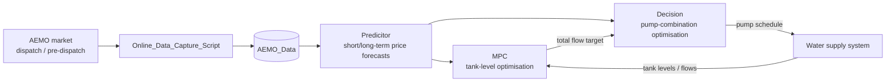

```markdown
# EMPC_Water_Electricity_Forecast

Forecasting of electricity prices for economic model predictive control (EMPC) of pumping in water supply systems.

<!-- status badges (placeholders) -->


## 1. Capstone Project Overview

### 1.1 Background and Objectives

Energy costs associated with pumping in water distribution systems can be large. Some water companies buy electricity directly from the wholesale market, where the price varies randomly every 5 minutes. Water storages in distribution networks provide robustness against pump or pipeline failures, and they also allow operators to shift pumping from high-price periods to low-price periods.

A promising strategy for reducing energy cost is **economic model predictive control (EMPC)**, which requires forecasts of the electricity prices. AEMO (Australian Energy Market Operator) provides publicly available market data and forecasts.

The project goals are:

- Model the electricity price forecast error with parameterised models such as AR and ARMA.
- Estimate the model parameters online, taking into account that the forecasts are used in an EMPC setting.
- Implement an economic MPC strategy for pumping operation in a water supply system.

### 1.2 System Composition and Workflow



- **Online_Data_Capture_Script** fetches AEMO dispatch data (5-min updates) and pre-dispatch data (30-min forecasts, 48 h ahead) and appends them to `AEMO_Data`.
- **Predicitor** produces short-term and long-term electricity price forecasts, consumed by both optimisation layers.
- **MPC** (tank-level optimisation) decides, over a receding horizon, how much total inflow the tank system needs and when, based on the future water level, demand, level bounds and limits on how fast the total flow may change.
- **Decision** (pump-combination optimisation) decides which pumps to run, at what flow/power and for how long, in order to deliver the total flow requested by MPC at minimum power/energy cost.
- MPC and Decision are two coupled optimisation problems; the interface between them (total-flow target, schedule feedback) is **not yet fixed**.

Time scales: the spot price and the control step are aligned at 5 minutes; AEMO pre-dispatch forecasts arrive on a 30-minute grid with a 48-hour look-ahead.

### 1.3 Glossary

| Term | Meaning |
|---|---|
| AEMO | Australian Energy Market Operator; source of market data |
| RRP | Regional Reference Price, the wholesale electricity spot price |
| Dispatch | Real-time market data updated every 5 minutes |
| Pre-dispatch | AEMO's own forecasts (30-min grid, next 48 h) plus recent actuals |
| AR / ARMA | Autoregressive / Autoregressive Moving Average time-series models |
| RLS | Recursive Least Squares, an online parameter estimation algorithm |
| Daily template | 288-slot intraday mean price profile used as the day-shape baseline |
| EWMA | Exponentially Weighted Moving Average, used with truncation for template updating |
| EMPC | Economic Model Predictive Control |
| MPC | Model Predictive Control |
| Recursive (iterated) forecast | Multi-step forecast that feeds its own predictions back as inputs |
| Cadence | Interval between consecutive forecast updates |
| Horizon | Number of 5-minute steps ahead being forecast |

## 2. Changelog

Major updates are logged here, newest first. Entries are kept permanently and never deleted.

### [YYYY-MM-DD] — Predicitor: AR(4) + RLS + daily-template version

- Placeholder summary — replace with the actual update description and key results.

### Older entries

- Older entries remain below in reverse chronological order.

> Template for a new entry:
>
> ```markdown
> ### [YYYY-MM-DD] — <short title>
> - <what changed>
> - <key results / metrics>
> ```

## 3. Mathematical Background

The detailed derivation below currently covers the Predicitor. The Decision and MPC sections are marked **TBD** and will be filled in once their modules and interfaces are in place.

### 3.1 Predicitor

The Predicitor decomposes the price into a deterministic intraday shape (the **daily template**) plus a stochastic deviation modelled by an **AR(p)** process. Template values and AR coefficients are estimated/updated online; forecasts are generated by adding the template at the target time to a recursive AR forecast of the deviation.

Let $y_t$ denote the price at time $t$ (5-min samples, $/MWh).

#### 3.1.1 Data Preprocessing and Daily Template

**Step 1 — Slot mapping.** Each day has $n_s = 288$ slots of 5 minutes. A timestamp is mapped to a slot by

$$
s(t)=\mathrm{round}\!\left(\frac{60\,H(t)+M(t)}{5}\right)\in\{1,\dots,288\}
$$

with the convention $s=0 \mapsto 288$: $00{:}05 \to 1$, $23{:}55 \to 287$, and $00{:}00$ belongs to the previous day as its last slot.

**Step 2 — Data day and day class.** To respect the rule that the $00{:}00$ sample belongs to the previous day, the timestamp is shifted back by 1 minute before looking up the weekday. Each sample is assigned a class

$$
c(t)\in\{1,2\},\qquad 1=\text{weekday (Mon--Fri)},\quad 2=\text{weekend (Sat/Sun)}
$$

Public holidays are currently treated as weekdays; the holiday list can be maintained in `get_day_class`.

**Step 3 — Template construction.** The template $T_c(s)$ is the historical mean price of class $c$ at slot $s$:

$$
T_c(s)=\frac{\sum_{i\in\mathcal{I}_{c,s}} y_i}{\left|\mathcal{I}_{c,s}\right|}
$$

where $\mathcal{I}_{c,s}$ is the set of samples of class $c$ at slot $s$ inside the chosen time window. In code this is computed by point-wise accumulation of sums and counts; slots with no samples fall back to the class mean.

**Step 4 — Template window strategies.** Four strategies are supported:

- (a) **No class split**: a single 288-slot template averaged over all days.
- (b) **Weekday/weekend split**: separate templates for the two classes, averaged over all history.
- (c) **In-class rolling window** $[w_d,w_e]$: the weekday template uses the last $w_d$ weekdays, the weekend template the last $w_e$ weekend days, so both classes keep comparable sample counts.
- (d) **Truncated EWMA**: the template is the normalised exponentially weighted average of daily profiles,

$$
T_c=\frac{\sum_{k=0}^{n-1}(1-\alpha)^k\,p_k}{\sum_{k=0}^{n-1}(1-\alpha)^k}
$$

where $p_0$ is the most recent in-class day and $p_{n-1}$ the oldest. The sum is truncated at

$$
K=\left\lfloor\frac{\ln\varepsilon}{\ln(1-\alpha)}\right\rfloor
$$

i.e. days whose weight falls below the threshold $\varepsilon$ are dropped entirely, so the buffer is strictly bounded. Defaults: $\alpha=0.15$, $\varepsilon=0.01$, giving $K=28$ in-class days. Weekday and weekend buffers are maintained and updated independently; each class has an effective in-class memory of about $1/\alpha$ in-class days.

**Step 5 — Centring.** The AR model has no intercept, so the series is centred before modelling. With a template, the deviation used by RLS is

$$
r_t=y_t-T_{c(t)}\bigl(s(t)\bigr)
$$

For the pure-AR variant without a template, $r_t=y_t-\mu$ with $\mu$ the mean of the training period.

#### 3.1.2 AR(p) Model and Recursive Forecasting

The centred deviation is modelled as an AR(p) process (currently $p=4$):

$$
r_t=\sum_{j=1}^{p}\phi_j\,r_{t-j}+\varepsilon_t,\qquad \varepsilon_t\sim\mathrm{WN}(0,\sigma^2)
$$

**One-step forecast:**

$$
\hat{r}_{t+1|t}=\sum_{j=1}^{p}\phi_j\,r_{t+1-j}
$$

**Multi-step recursive forecast.** For horizon $h\ge 1$, with coefficients frozen at the forecast origin $t$:

$$
\hat{r}_{t+h|t}=\sum_{j=1}^{p}\phi_j\,\tilde{r}_{t+h-j},\qquad
\tilde{r}_{t+h-j}=
\begin{cases}
r_{t+h-j}, & h-j\le 0 \quad \text{(observed)}\\[2pt]
\hat{r}_{t+h-j|t}, & h-j>0 \quad \text{(predicted, fed back)}
\end{cases}
$$

For $h>p$ every input is itself a prediction, so the forecast error accumulates with the horizon. The implementation (`predict_ar_recursive`) keeps a newest-first buffer of length $p$:

1. Initialise the buffer with the last $p$ centred observations.
2. For $s=1,\dots,H$: predict $\hat r=\theta^{\top}\mathrm{buf}$, then shift the buffer with $\hat r$.
3. Return the $H$ predictions.

**Price forecast.** The final price forecast adds the template at the target time:

$$
\hat{y}_{t+h|t}=T_{c(t+h)}\bigl(s(t+h)\bigr)+\hat{r}_{t+h|t}
$$

The class of each target time is evaluated individually, so the template switches automatically at midnight when the forecast crosses from a weekday into the weekend. For a stationary AR process $\hat{r}_{t+h|t}\to 0$ as $h$ grows, so a pure AR forecast decays toward the mean — this is exactly why the template is needed to carry the intraday shape beyond roughly the first hour. The order $p=4$ was selected by sweeping $p=1,\dots,10$.

#### 3.1.3 Online Parameter Estimation with RLS

Let $\theta=[\phi_1,\dots,\phi_p]^{\top}$ and let $u_k=[r_{k-1},\dots,r_{k-p}]^{\top}$ be the regression vector at sample $k$. RLS minimises the exponentially weighted squared-error cost

$$
J(\theta)=\sum_{i=1}^{k}\lambda^{k-i}\left(r_i-u_i^{\top}\theta\right)^2
$$

**Initialisation** (warm-up):

1. $\theta_0=0_{p\times 1}$, $P_0=\delta I_p$ with $\delta=100$.
2. The first $p$ samples only fill the history buffer and are passed through unchanged.
3. Once the buffer is full, the filter becomes active with the initial guess $\theta_1=1$ (i.e. $y_k\approx y_{k-1}$) and $P_0=\delta I$.

**Recursion** for each new sample $r_k$:

$$
\begin{aligned}
K_k &= \frac{P_{k-1}\,u_k}{\lambda+u_k^{\top}P_{k-1}\,u_k}\\[4pt]
e_k &= r_k-u_k^{\top}\theta_{k-1}\\[4pt]
\theta_k &= \theta_{k-1}+K_k\,e_k\\[4pt]
P_k &= \frac{1}{\lambda}\left(I-K_k\,u_k^{\top}\right)P_{k-1}
\end{aligned}
$$

where $K_k$ is the gain, $e_k$ the prior prediction error, $\theta_k$ the updated coefficients and $P_k$ the inverse-correlation-like covariance matrix. The forgetting factor is $\lambda=0.98$, corresponding to an effective memory of about $1/(1-\lambda)=50$ samples.

**Numerical safeguards** (implemented in `apply_rls_filter`):

1. Denominator guard: skip the update if the denominator is below $10^{-10}$.
2. Error clipping: $|e_k|\le 0.5$, so single spikes cannot kick the coefficients away.
3. Symmetrisation of $P$ after each update.
4. Ridge regularisation: $P\leftarrow P+\varepsilon I$ with $\varepsilon=10^{-6}$.
5. Trace bound: rescale $P$ if $\mathrm{trace}(P)>10^{6}$.
6. Condition-number check: soft restart ($P=\delta I$, keep $\theta$) if $\mathrm{cond}(P)>10^{10}$.

#### 3.1.4 Long-Term and Short-Term Forecasting Strategy

**Daily protocol (long-term forecast).** Each day at 00:00 (the last sample of the previous day):

1. Snapshot the current RLS coefficients $\theta$ and history buffer.
2. Freeze $\theta$ and recursively forecast 288 steps (24 h) of $\hat r$; add the template sequence to obtain $\hat y$.
3. As the actual samples of the day arrive step by step, feed them through RLS so the coefficients keep learning (the issued forecast is not revised).
4. At 00:00, update the templates (rebuild the in-class rolling window, or push yesterday's profile into the truncated EWMA).

**Update cadence (short-term strategy).** The same machinery is reused with a cadence $K$: every $K$ steps a new 288-step forecast is issued and only its first $K$ steps are used, so the effective horizon of a forecast lies in $[1,K]$:

| $K$ (steps) | Cadence | Effective horizon |
|---|---:|---:|
| 1 | 5 min | 1 |
| 6 | 30 min | 1–6 |
| 12 | 1 h | 1–12 |
| 72 | 6 h | 1–72 |
| 288 | 24 h | 1–288 |

A larger $K$ means a longer average lead time, staler coefficients and a staler history buffer, hence larger errors; a smaller $K$ lowers the error at the cost of more frequent forecast computations and data exchange.

**Remarks (key experimental findings):**

- AR(4) plus the weekday/weekend daily template clearly outperforms pure AR(4) at long horizons; the template carries the day shape and the AR term handles short-term deviations.
- The truncated EWMA template ($\alpha=0.15$) performs on par with the 28-day in-class rolling window while keeping the memory strictly bounded.
- More frequent forecast updates monotonically lower the RMSE; the 5-min cadence is best with diminishing returns.
- Overall RMSE comparisons between the 6-h and 24-h cadences must be read with care: the 24-h cadence has a single daily forecast origin at 00:00 (the calmest block of the day), which flatters its average error; same-horizon comparisons are the fair metric.

### 3.2 Decision (Pump-Combination Optimisation) — TBD

Under development (Mingke). The optimisation variables, objective and constraints — which pumps to run, their flow and power, the running time of each combination, and minimising power/energy cost while delivering the total flow requested by MPC — will be documented once the MPC–Decision interface is fixed.

### 3.3 MPC (Tank-Level Optimisation) — TBD

Under development (Kehong). The tank-level dynamics, the water-demand model, the level bounds, the forecast horizon and the limits on the total-flow rate of change, together with the objective function, will be documented once the module is in place.

## 4. Repository Structure

```text
EMPC_Water_Electricity_Forecast/
├── AEMO_Data/                      # monthly AEMO price & demand CSVs (VIC1)
│   ├── PRICE_AND_DEMAND_202601_VIC1.csv
│   ├── PRICE_AND_DEMAND_202602_VIC1.csv
│   ├── PRICE_AND_DEMAND_202603_VIC1.csv
│   ├── PRICE_AND_DEMAND_202604_VIC1.csv
│   ├── PRICE_AND_DEMAND_202605_VIC1.csv
│   ├── PRICE_AND_DEMAND_202606_VIC1.csv
│   ├── PRICE_AND_DEMAND_202607_VIC1.csv
│   └── PRICE_AND_DEMAND_202608_VIC1.csv
├── Decision/                       # empty — to be populated (pump-combination optimisation)
├── MPC/                            # empty — to be populated (tank-level MPC)
├── Online_Data_Capture_Script/     # empty — to be populated (AEMO live data capture)
├── Predicitor/
│   ├── AR_RLS_predictor/
│   ├── Kalman_predictor/
│   └── Testing_Filter/
├── Simulation_Log/                 # Author_YYYYMMDD/<experiment>/..., updated continuously (not expanded here)
├── .gitignore
├── Github_Code.txt
├── LICENSE.md
└── README.md
```

`Simulation_Log` grows with every simulation campaign and is therefore intentionally not expanded in the tree above.

## 5. Directory and File Descriptions

### 5.1 AEMO_Data

Raw monthly data downloaded from AEMO, region VIC1, at 5-minute resolution. Each file follows the `PRICE_AND_DEMAND_YYYYMM_VIC1.csv` naming and the format

| REGION | SETTLEMENTDATE | TOTALDEMAND | RRP | PERIODTYPE |
|---|---|---|---|---|
| VIC1 | 2026/1/1 0:05 | 4188.23 | 58.51 | TRADE |

The folder currently contains realised historical prices and demand only, with no AEMO self-forecasts; those will be added by `Online_Data_Capture_Script`.

### 5.2 Predicitor

The electricity price predictor, producing short-term and long-term forecasts for both optimisation layers.

- `AR_RLS_predictor/` — daily template construction and updating, AR(p) recursive forecasting, RLS online estimation, and the experiment/sweep scripts (order sweep, template class long test, update-cadence sweep, prediction experiment).
- `Kalman_predictor/` — Kalman-filter-based price predictor (initial version).
- `Testing_Filter/` — online test filters for past data: moving average, moving median and the RLS filter with numerical safeguards.

### 5.3 MPC

All MPC-related files of the tank-level optimisation layer. It is concerned with the future water level, the water demand, the level lower/upper bounds, the forecast horizon and the limit on how fast the total flow may change. The folder will hold the tank/pump system models, the shared `system_config`, the AEMO data loader, the demo main script and the first-version MPC.

### 5.4 Decision

All decision-related files of the pump-combination optimisation layer. It decides which pumps to run, their flow and power, which combination to use and for how long, so as to minimise power/energy cost while meeting the total flow requested by MPC.

### 5.5 Online_Data_Capture_Script

A script to fetch live AEMO data and update `AEMO_Data`:

- **Dispatch** (5-min updates): current and historical spot price and demand, last 48 hours.
- **Pre-dispatch** (30-min updates): AEMO's forecast spot price and forecast scheduled demand for the next 48 hours.

See Appendix 7.1 for the source tables and fields.

### 5.6 Simulation_Log

Simulation figures and reports, organised as `Author_YYYYMMDD/<experiment>/`, each containing the `Report.txt` and the `.fig` files of that campaign. Updated continuously.

### 5.7 Root Files

`.gitignore`, `LICENSE.md`, `Github_Code.txt` (code-sharing notes) and this `README.md`.

## 6. Task Breakdown and Team

| Module | Owner | Responsibility | Interface / Dependencies |
|---|---|---|---|
| Predicitor | Ash | Short- and long-term electricity price forecasting (AR + RLS + daily template; Kalman initial version) | Provides forecasts to MPC and Decision |
| MPC | Kehong | Tank-level optimisation: future level, demand, level bounds, horizon, total-flow change limits | Consumes Predicitor forecasts; exchanges the total-flow target with Decision (interface TBD) |
| Decision | Mingke | Pump-combination optimisation: pump selection, flow/power, runtime, minimum energy cost | Consumes Predicitor forecasts and the MPC total-flow target (interface TBD) |
| Online_Data_Capture_Script | TBD | Live capture of AEMO dispatch/pre-dispatch data into AEMO_Data | Feeds AEMO_Data |

## 7. Appendix

### 7.1 AEMO Data Reference

The official description of the two data views:

- **Pre-dispatch** — contains a mix of 5-minute and 30-minute intervals: demand (current and historical demand at 5 min, and forecast scheduled demand at 30 min, last 24 hours) and pricing (current and historical spot price at 5 min, and forecast spot price at 30 min, next 48 hours).
- **Dispatch** — updated every 5 minutes: current and historical demand and spot price, last 48 hours. The displayed spot prices are time-weighted.

Source tables and fields (MMS): `TradingPrice.RRP` (spot price, 5 min), `PreDispatchPrice.RRP` (forecast spot price), `DispatchRegionSum.ClearedSupply` (scheduled demand, 5 min), `PredispatchRegionSum.ClearedSupply` (scheduled demand pre-dispatch).

### 7.2 References

1. AEMO, NEM market data. https://aemo.com.au
2. Box, G. E. P., Jenkins, G. M., Reinsel, G. C., Ljung, G. M., *Time Series Analysis: Forecasting and Control*, 5th ed., Wiley, 2015.
3. Haykin, S., *Adaptive Filter Theory*, 5th ed., Pearson, 2014.
4. Ellis, M., Durand, H., Christofides, P. D., *A tutorial review of economic model predictive control methods*, Journal of Process Control, 24(8):1156–1178, 2014.
```