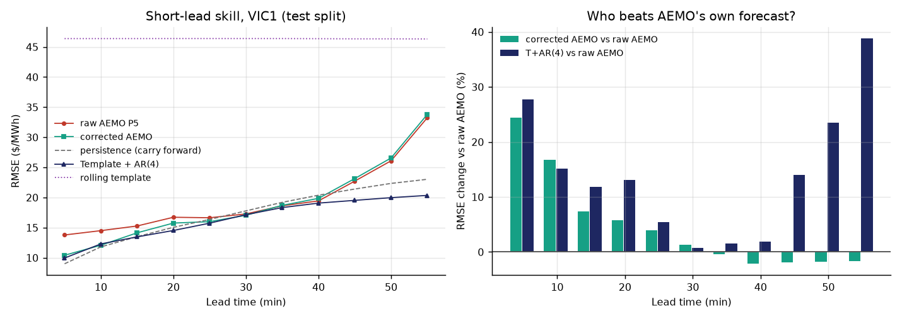

# AEMO 预测误差模型 —— 第一部分结果

> 2026-09-23 周 ｜ 可重放：`../data_audit/scripts/backfill_archive.py` →
> `../data_audit/scripts/build_error_matrix.py` → `weekly_p5_compare.m` → `p5_vs_tar.py`
> 原始输出：`../data_audit/scripts/error_matrix_report.txt`、`p5_vs_tar_report.txt`
> **本文件不含待办**（待办去 `../TODO.md`）。

---

## 1. 协议

AEMO 的 P5 产品每 5 分钟发布一批，每批带 12 个目标：第一个就是发布时正在进行的那个
区间，往后每 5 分钟一个，共覆盖 55 分钟。

```
预测发布时刻              k_i        （批次 effective_time）
批次内的目标              k_i + 5h,  h = 0..11
lead 定义                 h（5 分钟步数）；h=0 是发布时正在进行的区间
误差                      e(k, k_i) = y(k) − ŷ_AEMO(k | k_i)
已实现误差                ε(k) = e(k, k) = y(k) − ŷ_AEMO(k | k)
```

**无前视**：批次 k_i 与区间 k_i 的实际价格都在 k_i 前约 5 分钟发布，所以用批次 k_i
去预测 k_i+5min 起的目标，信息集是干净的。

**h=0 不参与任何 skill 比较**：它与 ε(k_i) 是同一个数，「用它预测它」属于自证。

数据窗口 **2026-08-25 → 2026-09-22，VIC1，8,064 个区间**，配对成功 **96,702 行**。
训练 / 测试按时间 70 / 30 切分。

---

## 2. 误差随提前量增长，且系统性偏低


| lead | 5 min | 15 min | 30 min | 45 min | 55 min |
|---|---|---|---|---|---|
| RMSE ($/MWh) | 14.97 | 16.57 | 19.06 | 23.36 | **42.19** |
| MAE | 8.23 | 9.24 | 10.41 | 12.34 | 16.17 |
| bias | +3.02 | +3.00 | +1.53 | +0.67 | −1.63 |

- 同一段实际价的**标准差 50.11 $/MWh** —— RMSE 42 已经逼近「没有预测能力」的量级。
- 短提前量上 bias 稳定为正（+3 左右）：这段窗口里 AEMO **系统性低估** VIC1。
- 长提前量上 bias 转负，但样本里有一次 +215.6 $/MWh 的误差事件，尾部很重。

---

## 3. 误差成串出现 —— 教授的判断被数据证实


`ε(k)` 的统计（n = 8,064）：

| 量 | 值 |
|---|---|
| mean / std | +3.865 / 10.699 |
| min / max | −52.1 / **+215.6** |
| 非零占比 | 0.751 |
| **ACF(1)** | **+0.682** |
| ACF(2) / ACF(3) | +0.605 / +0.545 |
| ACF(12) | +0.272 |
| **同号连续段平均长度** | **6.152**（随机符号应为 2.00） |
| 最长同号段 | **122 个区间 = 10.2 小时** |

「AEMO 现在偏高或偏低，接下来几个相邻时刻往往还是同方向」——在这段样本里成立，
而且比预想的强得多：误差不是零散的噪声，是成串的偏差。

---

## 4. 修正有效，但只在 5~25 分钟这一档

三个修正模型都用**训练集**拟合、**测试集**评分（2,419 个样本）：

- **C1** `ê(h) = β_h · ε(k_i)` —— 直接搬运最近一次已实现误差
- **C2** `ê(h) = β_h · mean(ε(k_i−2 .. k_i))` —— 同上但先去噪
- **C3** `ê(h) = a_h + Σ_{j=0..3} b_hj · ε(k_i − j)` —— 每个提前量单独做四阶滞后 OLS

| lead | 5 min | 10 min | 20 min | 30 min | 40 min | 55 min |
|---|---|---|---|---|---|---|
| 原始 AEMO RMSE | 15.04 | 15.24 | 17.67 | 18.31 | 20.28 | 30.45 |
| **C3 修正后** | **13.08** | **13.51** | **17.22** | 18.03 | 20.37 | 30.88 |
| C3 增益 | **+13.0%** | **+11.4%** | +2.5% | +1.5% | −0.4% | −1.4% |
| C1 增益 | +12.7% | +10.6% | +2.8% | +1.8% | −0.4% | −1.4% |
| C2 增益 | +11.4% | +9.9% | +1.9% | +1.2% | −0.3% | −1.3% |

- 三个模型差别很小，**C3 略优**；说明主要信号就是「最近一次误差」本身。
- **增益在 30 分钟处归零、之后转负。** 教授说的「修正随提前量衰减到 0」，
  实测不是平缓衰减而是**在半小时附近穿过零点** —— 长期部分应该直接交回 AEMO 原值。

---

## 5. 五路对照：没有单一赢家通吃这一小时



测试集（17,050 行，2026-09-16 14:25 → 09-21 23:55）逐提前量 RMSE：

| lead | 原始 AEMO | 修正后 AEMO | Persistence¹ | T+AR(4) | 滚动模板 | **赢家** |
|---|---|---|---|---|---|---|
| 5 min | 13.78 | 10.42 | **9.00** | 9.96 | 46.38 | persistence |
| 10 min | 14.50 | 12.08 | **11.81** | 12.30 | 46.38 | persistence |
| 15 min | 15.28 | 14.14 | 13.50 | **13.46** | 46.38 | T+AR(4) |
| 20 min | 16.72 | 15.76 | 15.05 | **14.53** | 46.39 | T+AR(4) |
| 25 min | 16.64 | 15.99 | 16.36 | **15.74** | 46.39 | T+AR(4) |
| 30 min | 17.28 | **17.05** | 17.78 | 17.15 | 46.38 | corrected AEMO |
| 35 min | 18.62 | 18.70 | 19.20 | **18.33** | 46.38 | T+AR(4) |
| 40 min | 19.44 | 19.85 | 20.38 | **19.07** | 46.36 | T+AR(4) |
| 45 min | 22.72 | 23.15 | 21.41 | **19.53** | 46.34 | T+AR(4) |
| 50 min | 26.09 | 26.56 | 22.34 | **19.97** | 46.34 | T+AR(4) |
| 55 min | 33.25 | 33.80 | 23.03 | **20.35** | 46.32 | T+AR(4) |

¹ 本表的 persistence = **把最近一次已实现价格原样搬运**（carry-forward）。
上一周基准里的 persistence 是「昨天同一时刻」，两者不是同一个基线，不要混用。

### 解读

1. **AEMO 原始 P5 从来没夺冠。** 5~10 分钟输给 carry-forward persistence，
   15 分钟以后输给 T+AR(4)，55 分钟时 RMSE 33.25 连 persistence 的 23.03 都不如。
   这不代表 AEMO 的预测没用 —— 它带的是**日前/机组组合层面的信息**，
   而这段窗口里 5 分钟尺度的最优信号恰好是「价格很黏」。
2. **修正后 AEMO 在 5 分钟上把 RMSE 从 13.78 拉到 10.42（+24.4%）**，
   但 30 分钟之后转为负收益，与 §4 的零点一致。
3. **T+AR(4) 在 15~55 分钟全程最强**，55 分钟时领先原始 AEMO 38.8%。
   它输在 5~10 分钟：那里价格的自相关最强，模板+AR 的递归反而引入了噪声。
4. **滚动模板单独用是完全不能打的**（46.4，与信号 std 50.1 同量级）；
   它只在 T+AR(4) 中长期部分才发挥作用。

---

## 6. 结论

1. **误差可预测，且短期可修正** —— 这是教授判断的直接验证，而且信号比预期强
   （ACF(1)=0.68、同号段平均 6.15 个区间）。
2. **修正只值 5~25 分钟**。半小时之后应交回 AEMO 原值，不要外推。
3. **MPC 真正要的那个量（未来 5~60 分钟的价格）在这一窗口里没有单一最优模型**：
   5~10 分钟用 carry-forward，15 分钟以后用 T+AR(4)，
   修正后 AEMO 只在 30 分钟附近短暂领先。
4. **因此「站在 AEMO 肩上」这条路在这段数据上没有被证明优于自建模型** ——
   它确实把 AEMO 自己改善了 24%，但改善后的 AEMO 仍然没有超过我们已有的
   T+AR(4)。下一步必须先解决这个对比的公平性问题（见 §7），再谈接 MPC。

---

## 7. 局限（必须随结论一起报）

1. **一个区域、一段窗口**：VIC1，2026-08-25 → 09-22，测试集只有 5 天。
   这段窗口含一次极端事件（最大误差 +215.6 $/MWh），尾部会主导长提前量的 RMSE。
2. **模板预热只有 10 天**，而 1 月基准用了 28~30 天。所以本表里的 T+AR(4)
   与上周基准的 T+AR(4)（5 min RMSE 15.8）**不可直接比较**。
3. **没有价格钳位**。上周基准把预测与实际都裁到滚动 30 日 Q1/Q99；
   本表用原始价格评分，正好被那次 +215 的事件放大。
4. **P5 只是 AEMO 的一个产品**。预调度（30 分钟粒度、48 小时视野）没进这次对照，
   而 MPC 的长时域部分更依赖它。
5. **没有成本结论**。RMSE 降了多少不等于 MPC 省了多少钱。

---

## 8. 下一步

1. 把修正模型与 T+AR(4) 放到**同一个信息集与同一段起源**上重跑，
   并统一加上价格钳位，消除 §7 的 2、3 两条不可比。
2. 扩到五个区域、把窗口从 28 天拉到 3 个月（ARCHIVE 有 375 个日包，
   P5MIN 约 57 MB/天，回填 3 个月约 5 GB 下载）。
3. 按提前量**分段**做模型选择（≤10 min 用 carry-forward，>10 min 用 T+AR(4)），
   并把「修正后 AEMO」作为其中一个候选而不是默认答案。
4. 误差模型稳定后再谈接入 MPC；接入前补一次成本对比。
